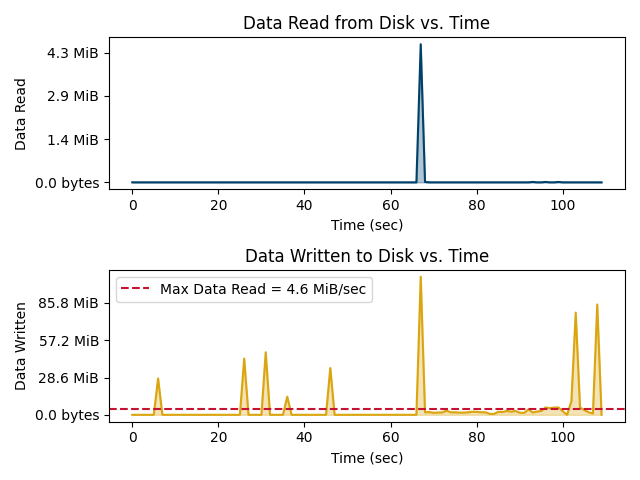
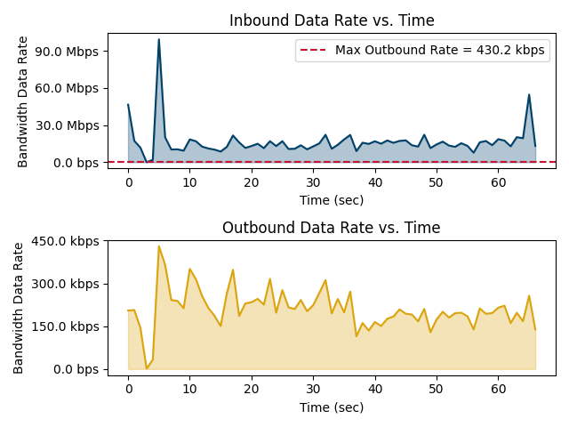

<legal>
Silent Sentinel

Copyright 2025 Carnegie Mellon University.

NO WARRANTY. THIS CARNEGIE MELLON UNIVERSITY AND SOFTWARE ENGINEERING
INSTITUTE MATERIAL IS FURNISHED ON AN "AS-IS" BASIS. CARNEGIE MELLON
UNIVERSITY MAKES NO WARRANTIES OF ANY KIND, EITHER EXPRESSED OR IMPLIED, AS
TO ANY MATTER INCLUDING, BUT NOT LIMITED TO, WARRANTY OF FITNESS FOR PURPOSE
OR MERCHANTABILITY, EXCLUSIVITY, OR RESULTS OBTAINED FROM USE OF THE MATERIAL.
CARNEGIE MELLON UNIVERSITY DOES NOT MAKE ANY WARRANTY OF ANY KIND WITH RESPECT
TO FREEDOM FROM PATENT, TRADEMARK, OR COPYRIGHT INFRINGEMENT.

Licensed under a MIT (SEI)-style license, please see LICENSE.txt or contact
permission@sei.cmu.edu for full terms.

[DISTRIBUTION STATEMENT A] This material has been approved for public release
and unlimited distribution. Please see Copyright notice for non-US Government
use and distribution.

This Software includes and/or makes use of Third-Party Software each subject
to its own license.

DM25-0550
</legal>

# Interpretation Guide

## Introduction

The Silent Sentinel instrumentation platform uses static and dynamic analysis techniques to gather information about a given piece of software and the impact of that software on a system. This document (1) describes the tools and methods Silent Sentinel uses to collect this information and (2) is intended to help reviewers[^1] interpret the information.

Static analysis techniques provide information about the software file(s), while dynamic analysis techniques collect data from the system as the software is running. The resulting data from both analysis techniques is stored and compiled into a report. Reviewers can evaluate the report's contents to scrutinize the software and consider its expected impact on the environment where it is installed and/or executed.

[^1]: In this document, the term reviewer refers to a person who reads and interprets the data in the Silent Sentinel report.

## Evaluating the Software

There are many factors that can be considered when evaluating a piece of software. This section describes several points to consider when reviewing the data contained in the Silent Sentinel report. These points are meant only as guidelines; the criteria for acceptable characteristics and impact will differ for each piece of software and its deployment environment.

### Deployment Platform

The system administrator of the intended deployment platform must fully understand the software deployment's requirements to ensure the platform can meet the software requirements. System administrators should be able to answer questions such as the following:

 * What is the host operating system?
 * What patch level of the host operating system is installed?
 * How many users are expected to engage with the software and what rights/permissions do they require?
 * What versions of other software are currently running on the system?
 * Are there any antivirus or other protection mechanisms in place that will detect unexpected activity or inhibit expected activity?
 * What type of system logging is required?

To properly evaluate the software's impact on the deployment platform, stakeholders, including the platform system administrators and the software's end users, should work together to create and answer these and similar questions.

### Characteristic and Impact Analysis

When examining the Silent Sentinel report, stakeholders should consider many points around each of the instrumentation tools. Using several tools as examples, the stakeholders should consider the following points:

 * When reviewing the **strings** output,
    - Are personal identifiers allowed?
    - Is there a known list of disallowed words?
 * When reviewing the **pspy** output,
    - Were any undesirable or unexpected process elements captured?
    - Did the execution of the software result in any unexpected or unacceptable filesystem changes?
    - Were any other processes notably impacted by the execution of the software?
 * When reviewing the **netflow** output,
    - Were there any unexpected destination IP addresses?

## Interpreting Report Findings

Silent Sentinel uses a collection of different tools to examine the static characteristics of software and the dynamic impact of a piece of software under test on the system where it is installed and/or executed. This section describes how reviewers can evaluate the outputs of those tools in the report.

### strings

One of the most commonly used tools for performing surface analysis of software is strings, which scans for and prints sequences of printable characters contained in a file. The output of the strings command contains important information, such as the software's compilation date and time, native language, installation locations, and username and password combinations. Silent Sentinel outputs all strings that match words in a user-provided word list. The word list can contain, for example, the name of an untrusted software publisher.

To further augment Silent Sentinel's capability to detect unwanted content within the software, Silent Sentinel enables the operator to analyze strings in memory while the software under test is executing. Silent Sentinel generates a core dump by attaching a gdb debugger instance to the process, then runs strings on the core dump contents, and finally compares that data against the provided word list. Silent Sentinel outputs all strings found in the core dump that match words in the provided word list. This feature operates in much the same way as simply running strings on the executable file; however, since that is a surface analysis technique, encrypted or hidden strings may be concealed from the user. Utilizing a core dump technique during a dynamic analysis phase allows Silent Sentinel to view any obfuscated data items after the software has decrypted or decoded them during runtime.

A core dump cannot be created when strace is running because gdb and strace cannot attach to the same process concurrently.

Silent Sentinel reports one of three possible outcomes of the strings analysis:

1. When a _wordlist_ file is provided and a match is detected, the report will contain output like the following example:

```{.bash .numberlines}
The strings analysis detected the following matches in the provided dirty word list:
# macbeth was here
```
*Figure 1: Sample `strings` outputs*

2. When a _wordlist_ file is provided and no match is detected, the report will contain the following output:

```{.bash .numberlines}
The strings analysis did not detect any matches in the provided dirty word list.
```
*Figure 2: Sample `strings` outputs*

3. When no _wordlist_ file has been provided, the report will contain the following output:

```{.bash .numberlines}
The strings analysis was not run.
```
*Figure 3: Sample `strings` outputs*

### YARA

[YARA](https://yara.readthedocs.io/en/stable/index.html) is a tool used to detect textual or binary patterns in target files. Its purpose is to help security analysts identify and classify malware samples. YARA identifies malware samples by matching known patterns of text strings or hexadecimal characters, matching regular expressions, counting the occurrences of string patterns, measuring the address offset of a tool under a test's entrypoint, and more. The YARA rules [documentation](https://yara.readthedocs.io/en/stable/writingrules.html) describe the full range of YARA’s capabilities and how to understand the YARA rule syntax.

Silent Sentinel reports one of three possible outcomes for YARA.

1. When a _rules.yar_ file is provided and a match is detected, the report will contain output like the following example, where the _rules.yar_ file contained several string patterns found in the target file:

```{.bash .numberlines}
The YARA scan detected the following match(es) in the provided rules:

String_Match [author="A. Carnegie",date="2025-03-10",description="Detects for any data exfiltration or tool installation patterns"] /vol/test-yara.sh
0x72:$Quarantine_Message1: install
0xa3:$Quarantine_Message1: install
0xd9:$Quarantine_Message2: Upload
Web_URL_Match [author="A. Carnegie",date="2025-03-10",description="Detects for strings that have suspicious web URL"] /vol/test-yara.sh
0x110:$target_website: malwarestring
Low_Entropy [author="A. Carnegie",date="2025-03-10",description="Detects if file contents are unencrypted"] /vol/test-yara.sh
```

*Figure 4: Sample `YARA` signature match outputs*

2. When a _rules.yar_ file is provided and no match is detected, the report will contain the following output:

```{.bash .numberlines}
The YARA scan did not detect any matches in the provided rules.
```

*Figure 5: Sample `YARA` signature match outputs*

3. When no _rules.yar_ file has been provided, the report will contain the following output:

```{.bash .numberlines}
YARA was not run.
```

*Figure 6: Sample `YARA` signature match outputs*

### clamscan

ClamAV is an open source, signature-based antivirus toolkit. Silent Sentinel uses the clamscan component of ClamAV to determine whether the tool under test matches any known signatures in the ClamAV signature database. The result 'OK' indicates that clamscan did not detect any signature matches. The result 'FOUND' indicates a match was detected; this finding should initiate further analysis to determine why the match was detected.

```{.bash .numberlines}
/usr/local/sbin/a-binary: OK

----------- SCAN SUMMARY -----------
Known viruses: 8698861
Engine version: 1.0.7
Scanned directories: 0
Scanned files: 1
Infected files: 0
Data scanned: 35.96 MB
Data read: 33.77 MB (ratio 1.06:1)
Time: 21.725 sec (0 m 21 s)
Start Date: 2024:09:27 12:05:33
End Date:   2024:09:27 12:05:55


/tmp/eicar.com.txt: Win.Test.EICAR_HDB-1 FOUND

----------- SCAN SUMMARY -----------
Known viruses: 8698861
Engine version: 1.0.7
Scanned directories: 0
Scanned files: 1
Infected files: 1
Data scanned: 0.00 MB
Data read: 0.00 MB (ratio 0.00:1)
Time: 40.198 sec (0 m 40 s)
Start Date: 2024:09:27 12:23:35
End Date:   2024:09:27 12:24:15
```

*Figure 7: sample `clamscan` Outputs*

### crontabs

In Linux, cron jobs are used to schedule and run tasks in the operating system; these tasks are analogous to systemd timers in Linux and scheduled tasks in Windows. By monitoring the cron jobs in the testing environment through crontabs, Silent Sentinel can identify any changes to the baseline scheduled tasks. For example, the addition of a new scheduled task could indicate that the software under test is using cron jobs to persist data or define reoccurring activity. Furthermore, modification of the cron jobs could indicate that the software under test is interfering with other scheduled tasks.

```{.diff .numberlines}
--- /vol/testharness/crontabs/2023-12-06_18-52-53.886974553.out 2023-12-06 18:52:53.909086107 +0000
+++ /vol/testharness/crontabs/2023-12-06_18-52-53.916390934.out 2023-12-06 18:52:53.936086356 +0000
@@ -276,0 +277,5 @@
+/var/spool/cron/crontabs/root
+# DO NOT EDIT THIS FILE - edit the master and reinstall.
+# (- installed on Wed Dec 6 18:52:53 2023)
+# (Cron version -- $Id: crontab.c,v 2.13 1994/01/17 03:20:37 vixie Exp $)
+0 5 * * 1 true
```

*Figure 8: Sample `crontabs` Output*

### ps

Silent Sentinel gathers process status information using the ps command. Not only does ps list the current running processes on the system under test, it also lists additional information about each process, such as the process identification number (PID), the amount of CPU time that the process has been running, the user that owns the process, and the name of the command that launched the process.

```{.diff .numberlines}
--- /vol/testharness/ps/2025-05-13_13-14-54.203998893_filtered.out      2025-05-13 13:15:19.776660593 +0000
+++ /vol/testharness/ps/2025-05-13_13-14-54.249130658_filtered.out      2025-05-13 13:15:19.777663521 +0000
@@ -2 +2 @@
-root           1       0 10 13:14 pts/0    00:00:00 /sbin/docker-init -- /entrypoint.sh sh -c tail -f /dev/null &
+root           1       0  8 13:14 pts/0    00:00:00 /sbin/docker-init -- /entrypoint.sh sh -c tail -f /dev/null &
@@ -7,2 +7,3 @@
-root          57       6  0 13:14 pts/0    00:00:00 cat /run/oneshots_complete
-root          62      27  0 13:14 pts/0    00:00:00 ps -ef
+root          79       1  0 13:14 pts/0    00:00:00 tail -f /dev/null
+root          81       6  0 13:14 pts/0    00:00:00 cat /run/oneshots_complete
+root          86      27  0 13:14 pts/0    00:00:00 ps -ef
```

*Figure 9: Sample `ps` Output*

### pspy

Since executing ps will list only one single instance of running processes, Silent Sentinel utilizes pspy so that it can also continuously monitor executing processes at a specified time interval. Including this tool allows for near-continuous monitoring of system process execution, similar to that of Windows Process Monitor. Additionally, pspy can monitor directories and subdirectories with inotify events, allowing Silent Sentinel to observe real-time changes to the filesystem.

The output of pspy may be parsed much in the same way as the output of ps: all process execution and system events created by the software under test are logged for review.

```{.bash .numberlines}
2023/12/04 18:43:11 FS:                 OPEN | /usr/lib/x86_64-linux-gnu/libpcre2-8.so.0.11.2
2023/12/04 18:43:11 FS:               ACCESS | /usr/lib/x86_64-linux-gnu/libpcre2-8.so.0.11.2
2023/12/04 18:43:11 FS:        CLOSE_NOWRITE | /usr/lib/x86_64-linux-gnu/libpcre2-8.so.0.11.2
2023/12/04 18:43:11 FS:        CLOSE_NOWRITE | /usr/bin/netstat
2023/12/04 18:43:11 FS:                 OPEN | /usr/bin/ps
2023/12/04 18:43:11 CMD: UID=0     PID=34     | /bin/bash /oneshots.sh
2023/12/04 18:43:11 FS:               ACCESS | /usr/bin/ps
2023/12/04 18:43:11 FS:               ACCESS | /usr/bin/ps
2023/12/04 18:43:11 FS:               ACCESS | /usr/bin/ps
2023/12/04 18:43:11 FS:                 OPEN | /usr/lib/x86_64-linux-gnu/ld-linux-x86-64.so.2
2023/12/04 18:43:11 FS:               ACCESS | /usr/lib/x86_64-linux-gnu/ld-linux-x86-64.so.2
2023/12/04 18:43:11 FS:               ACCESS | /usr/lib/x86_64-linux-gnu/ld-linux-x86-64.so.2
2023/12/04 18:43:11 FS:        CLOSE_NOWRITE | /usr/lib/x86_64-linux-gnu/ld-linux-x86-64.so.2
2023/12/04 18:43:11 FS:                 OPEN | /etc/ld.so.cache
2023/12/04 18:43:11 FS:        CLOSE_NOWRITE | /etc/ld.so.cache
2023/12/04 18:43:11 FS:                 OPEN | /usr/lib/x86_64-linux-gnu/libproc2.so.0.0.1
2023/12/04 18:43:11 FS:               ACCESS | /usr/lib/x86_64-linux-gnu/libproc2.so.0.0.1
2023/12/04 18:43:11 FS:        CLOSE_NOWRITE | /usr/lib/x86_64-linux-gnu/libproc2.so.0.0.1
```

*Figure 10: Sample `pspy` Output*

### strace

To enumerate all system calls, Silent Sentinel utilizes the Linux diagnostic utility strace. This utility logs all process interactions with the Linux kernel and provides extensive information regarding those interactions. The reviewer may need to thoroughly analyze and interpret the log capture to determine if the software under test abnormally affects the host operating system at a deeper level. This review can reveal more information than a simple process listing to provide more context of the interactions of the software under test in the deployment environment.

```{.json .numberlines}
{"syscall":"execve","args":["/usr/bin/sh",["sh","-c","iptables -A OUTPUT -j ACCEPT; pi"],140725973179032,"..."],"result":0,"timing":null,"pid":61,"type":"SYSCALL"}
{"syscall":"brk","args":[],"result":94367749341184,"timing":null,"pid":61,"type":"SYSCALL"}
{"syscall":"mmap","args":[null,8192,["PROT_READ","PROT_WRITE"],["MAP_PRIVATE","MAP_ANONYMOUS"],-1,0],"result":140395554639872,"timing":null,"pid":61,"type":"SYSCALL"}
{"syscall":"access","args":["/etc/ld.so.preload",{"name":"R_","value":["OK"]}],"result":"-1 ENOENT (No such file or directory)","timing":null,"pid":61,"type":"SYSCALL"}
{"syscall":"openat","args":[["AT_FDCWD"],"/etc/ld.so.cache",{"name":"O_","value":["RDONLY","O_CLOEXEC"]}],"result":3,"timing":null,"pid":61,"type":"SYSCALL"}
{"syscall":"mmap","args":[null,7566,["PROT_READ"],["MAP_PRIVATE"],3,0],"result":140395554631680,"timing":null,"pid":61,"type":"SYSCALL"}
{"syscall":"close","args":[3],"result":0,"timing":null,"pid":61,"type":"SYSCALL"}
{"syscall":"openat","args":[["AT_FDCWD"],"/lib/x86_64-linux-gnu/libc.so.6",{"name":"O_","value":["RDONLY","O_CLOEXEC"]}],"result":3,"timing":null,"pid":61,"type":"SYSCALL"}
```

*Figure 11: Sample `strace` Output*

### path

The PATH environment variable in Linux identifies the directories for the operating system to search when trying to execute binaries. Many new software installations modify the PATH variable to add the path to the software's executable files. However, if the modification of the PATH variable impacts the paths of other processes, these impacts would indicate unexpected behavior.

```{.bash .numberlines}
@@ -1 +1 @@
-/usr/local/sbin:/usr/local/bin:/usr/sbin:/usr/bin:/sbin:/bin
+/usr/local/sbin:/usr/local/bin:/usr/sbin:/usr/bin:/sbin:/bin:/dummy
```

*Figure 12: Sample `path` Output*

### memory statistics

Silent Sentinel gathers memory usage information within the execution environment to detect memory usage by the software. The memory_stat output displays any differences in the amount of memory used before and after the software is executed.

Silent Sentinel analyzes the following statistics for changes:

```
# per-memory cgroup local status
cache           - # of bytes of page cache memory.
rss             - # of bytes of anonymous and swap cache memory (includes
                  transparent hugepages).
rss_huge        - # of bytes of anonymous transparent hugepages.
mapped_file     - # of bytes of mapped file (includes tmpfs/shmem)
pgpgin          - # of charging events to the memory cgroup. The charging
                  event happens each time a page is accounted as either mapped
                  anon page(RSS) or cache page(Page Cache) to the cgroup.
pgpgout         - # of uncharging events to the memory cgroup. The uncharging
                  event happens each time a page is unaccounted from the cgroup.
swap            - # of bytes of swap usage
dirty           - # of bytes that are waiting to get written back to the disk.
writeback       - # of bytes of file/anon cache that are queued for syncing to
                  disk.
inactive_anon   - # of bytes of anonymous and swap cache memory on inactive
                  LRU list.
active_anon     - # of bytes of anonymous and swap cache memory on active
                  LRU list.
inactive_file   - # of bytes of file-backed memory on inactive LRU list.
active_file     - # of bytes of file-backed memory on active LRU list.
unevictable     - # of bytes of memory that cannot be reclaimed (mlocked etc).
```

Sources for interpreting the memory.stat data include:

 * [Memory Resource Controller documentation](https://www.kernel.org/doc/Documentation/cgroup-v1/memory.txt)

```{.bash .numberlines}
--- /vol/testharness/memory_stat/2023-12-04_18-43-11.704714193.out	2023-12-04 18:43:11.761123147 +0000
+++ /vol/testharness/memory_stat/2023-12-04_18-43-11.808558802.out	2023-12-04 18:43:11.864127448 +0000
@@ -1,3 +1,3 @@
-anon 9273344
-file 118784
-kernel 11149312
+anon 9388032
+file 286720
+kernel 11161600
@@ -14 +14 @@
-file_dirty 110592
+file_dirty 274432
@@ -20 +20 @@
-inactive_anon 9232384
+inactive_anon 9338880
@@ -22,2 +22,2 @@
-inactive_file 118784
-active_file 0
+inactive_file 278528
+active_file 8192
@@ -25,3 +25,3 @@
-slab_reclaimable 10012288
-slab_unreclaimable 441808
-slab 10454096
+slab_reclaimable 10050960
+slab_unreclaimable 426448
+slab 10477408
@@ -41 +41 @@
-pgfault 7440
+pgfault 12226
@@ -44 +44 @@
-pgactivate 4
+pgactivate 33
```

*Figure 13: Sample `memory_stat` Output*

### cpu statistics

Silent Sentinel gathers CPU usage information within the testharness execution environment to detect CPU usage by the software. The cpu_stat output displays any differences in the amount of CPU used before and after the software is executed.

Silent Sentinel analyzes the following statistics for changes:

```
usage_usec      - total time spent on the CPU, in microseconds.
user_usec       - time spent in user mode, in microseconds.
system_usec     - time spent in kernel mode, in microseconds.
```

Sources for interpreting the cpu.stat data include:

 * [Control Group V2 CPU Interface Files documentation](https://docs.kernel.org/admin-guide/cgroup-v2.html#cpu-interface-files)
 * [kernel/cgroup/rstat.c](https://git.kernel.org/pub/scm/linux/kernel/git/torvalds/linux.git/tree/kernel/cgroup/rstat.c?h=v6.7#n477)
 * [include/linux/sched/types.h](https://git.kernel.org/pub/scm/linux/kernel/git/torvalds/linux.git/tree/include/linux/sched/types.h?h=v6.7#n9)

```{.bash .numberlines}
--- /vol/testharness/cpu_stat/2024-02-12_20-29-26.234696858.out	2024-02-12 20:29:26.309357443 +0000
+++ /vol/testharness/cpu_stat/2024-02-12_20-29-26.373456524.out	2024-02-12 20:29:26.438358828 +0000
@@ -1,3 +1,3 @@
-usage_usec 352720
-user_usec 116224
-system_usec 236495
+usage_usec 475568
+user_usec 159479
+system_usec 316088
```

*Figure 14: Sample `cpu_stat` Output*

### Disk I/O Performance

Silent Sentinel measures the amount of data read from and written to hard drives. To isolate the tool under test's disk activity, Silent Sentinel uses data from `cgroups`. Docker creates dedicated cgroups for each container that it starts. Silent Sentinel analyzes only the cgroup for the testharness container so that it tracks disk I/O operations exclusively for the tool under test. Silent Sentinel does not include data from other containers or host operating system processes in the reported data.

Silent Sentinel displays disk I/O performance output as a graph in the report. In the example below, the tool under test installs some Linux packages. The "Data Written to Disk" plot shows a larger amount of data than the "Data Read from Disk" plot. This difference can be explained by installing new packages on a Linux operating system with data obtained from network downloads. Each subplot’s x-axis is scaled in seconds. Each subplot’s y-axis is scaled based on appropriate human-readable data quantities. Both subplots in this example measure the data read and data written in mebibytes per second (MiB/s).

Silent Sentinel plots a red-dashed line to show the scaling between the data read and data written subplots. This line is the lesser of the maximum data read rate and maximum data written rate. In this example, the maximum data read rate (4.6 MiB/s) is smaller than the data written rates, which are also measured in MiB/s.



*Figure 15: Sample Graph of Disk I/O Performance*

### docker diff

Silent Sentinel utilizes Docker containers to perform tests on the software. Because of this, changes to files or directories on the container's filesystem can be noted via the docker diff command. Executing the docker diff command results in one of the following symbols:

 * A - indicates that a file or directory was added
 * C - indicates that a file or directory was changed
 * D - indicates that a file or directory was deleted

Any changes to the Docker container's filesystem provide insight into the software's behavior, including any unexpected modifications made to the system.

```{.bash .numberlines}
A /vol
C /usr
C /usr/sbin
C /etc
C /etc/profile
C /run
A /run/oneshots_complete
A /run/oneshots_trigger
C /var
C /var/spool
C /var/spool/cron
C /var/spool/cron/crontabs
A /var/spool/cron/crontabs/root
```

*Figure 16: Sample `docker diff` Output*

### netstat

Silent Sentinel observes network statistics of TCP, UDP, and Unix domain sockets using the netstat command. Capturing netstat output before and after executing the software can help determine information such as the following:

 * opening or closing of ports
 * amount of traffic through ports
 * process ownership of ports

Any changes in port usage can indicate the presence of modified system behavior that warrants further inspection.

```{.bash .numberlines}
--- /vol/testharness/netstat/2023-12-06_18-02-33.769994374.out  2023-12-06 18:02:33.774158341 +0000
+++ /vol/testharness/netstat/2023-12-06_18-02-33.796281240.out  2023-12-06 18:02:33.800158584 +0000
@@ -2,0 +3 @@
+tcp        0      0 0.0.0.0:8080            0.0.0.0:*               LISTEN      51/nc
```

*Figure 17: Sample `netstat` Output*

### tcpdump

Silent Sentinel utilizes tcpdump to capture TCP/IP packets being transmitted or received over a network interface. The tool tcpdump allows packet analysis at a very granular level by decoding packet headers and enabling filtering on various options. Within these artifacts, all communication to and from a host during the test period is logged for analysis. Most significantly, analysis should focus on potential unexpected traffic as well as any certificates used or needed for communication.

Silent Sentinel stores the data that tcpdump captures as PCAP files in the tool artifacts. The report does not directly display this data, but the data remains available for further analysis.

### ifconfig

Silent Sentinel uses interface configuration (ifconfig) to view the status of network interfaces on the host operating system. Details provided by ifconfig include information such as active status, hardware (MAC) address, IPv4/IPv6 address, and packets both transmitted and received. Modifications to system interface details may indicate concerning system activity caused by the software under test. This activity may require further investigation because the system under test should not observe any changes to network interfaces except for the number of packets that traversed the interface.

```{.bash .numberlines}
@@ -4 +4 @@
-        RX packets 12  bytes 1000 (1000.0 B)
+        RX packets 14  bytes 1140 (1.1 KiB)
@@ -6 +6 @@
-        TX packets 0  bytes 0 (0.0 B)
+        TX packets 2  bytes 140 (140.0 B)
@@ -12 +12 @@
-        RX packets 0  bytes 0 (0.0 B)
+        RX packets 6  bytes 491 (491.0 B)
@@ -14 +14 @@
-        TX packets 0  bytes 0 (0.0 B)
+        TX packets 6  bytes 491 (491.0 B)
```

*Figure 18: Sample `ifconfig` Output*

### iptables

To configure, maintain, and inspect the firewall rules of the Linux kernel, iptables can be used. If Silent Sentinel shows changes to the iptables rules list other than to the counters, it could indicate that the firewall was modified to allow, block, or redirect traffic. If the software under test is not designed to affect the system's firewall, changes to the captured firewall rules may require further investigation.

```{.bash .numberlines}
@@ -1,0 +2,8 @@
+*filter
+:INPUT ACCEPT [0:0]
+:FORWARD ACCEPT [0:0]
+:OUTPUT ACCEPT [0:0]
+[7:575] -A OUTPUT -j ACCEPT
+COMMIT
+# Completed on Thu Nov 30 14:22:02 2023
+# Generated by iptables-save v1.8.9 (nf_tables) on Thu Nov 30 14:22:02 2023
@@ -9,2 +17,2 @@
-[0:0] -A OUTPUT -d 127.0.0.11/32 -j DOCKER_OUTPUT
-[0:0] -A POSTROUTING -d 127.0.0.11/32 -j DOCKER_POSTROUTING
+[2:128] -A OUTPUT -d 127.0.0.11/32 -j DOCKER_OUTPUT
+[2:128] -A POSTROUTING -d 127.0.0.11/32 -j DOCKER_POSTROUTING
@@ -12 +20 @@
-[0:0] -A DOCKER_OUTPUT -d 127.0.0.11/32 -p udp -m udp --dport 53 -j DNAT --to-destination 127.0.0.11:58831
+[2:128] -A DOCKER_OUTPUT -d 127.0.0.11/32 -p udp -m udp --dport 53 -j DNAT --to-destination 127.0.0.11:58831
```

*Figure 19: Sample `iptables` Output*

### netflow (YAF)

Yet Another Flowmeter (YAF) is a sensor that captures traffic on a network, either live or from PCAP files, and generates flow data from a stream of the observed packets. YAF is a part of the CERT® NetSA Security Suite, which is a suite of open source tools used for monitoring large-scale networks using flow data. Silent Sentinel uses YAF to convert pcap data to netflow data, which is a condensed, human-readable format, and is displayed as text in the report.

The netflow data contains one flow per line with the following information:

 * start-time, end-time
 * duration
 * protocol
 * source or destination IP
 * source or destination port
 * type, code
 * TCP sequence number
 * TCP flags
 * VLAN tag
 * source or destination MAC address
 * packet count
 * octet count
 * round trip time
 * end-reason

Sources for interpreting the YAF data include:

 * [yafscii - YAF flow printer](https://tools.netsa.cert.org/yaf/yafscii.html#OUTPUT)

If Silent Sentinel detects any connections to or from unexpected hosts or network locations, it could indicate a misconfiguration or unexpected behavior and may require further investigation.

```{.bash .numberlines}
2023-12-04 18:42:25.101 icmp6 [135:0] :: => ff02::0001:ffeb:45fa (1/72 ->) eof
2023-12-04 18:42:25.118 ip 2 172.18.0.1 => 224.0.0.22 (1/40 ->) eof
2023-12-04 18:42:25.373 icmp6 [135:0] :: => ff02::0001:ff5d:3423 (1/72 ->) eof
2023-12-04 18:42:25.181 - 18:42:25.637 (0.456 sec) icmp6 [143:0] :: => ff02::0016 (3/268 ->) eof
2023-12-04 18:42:26.397 - 18:42:26.781 (0.384 sec) icmp6 [143:0] fe80::0042:5bff:fe5d:3423 => ff02::0016 (2/192 ->) eof
2023-12-04 18:42:26.141 - 18:42:27.101 (0.960 sec) icmp6 [143:0] fe80::002d:7fff:feeb:45fa => ff02::0016 (2/152 ->) eof
2023-12-04 18:42:26.141 - 18:42:56.221 (30.080 sec) icmp6 [133:0] fe80::002d:7fff:feeb:45fa => ff02::0002 (4/224 ->) eof
2023-12-04 18:43:11.784 icmp [8:0] 172.18.0.3 => 172.18.0.2 (1/84 ->) eof
2023-12-04 18:43:11.784 icmp [0:0] 172.18.0.2 => 172.18.0.3 (1/84 ->) eof
```
*Figure 20: Sample `YAF` Output*

### Network Interface Bandwidth Usage

Silent Sentinel measures the amount of ingress and egress network data on the testharness container at one-second intervals. By logging the testharness container's IP address, Silent Sentinel filters captured network traffic from this vantage point. Silent Sentinel graphs the captured network data to enable users to visualize patterns. For example, seeing a large amount of data or bursts of data leaving the testharness may indicate a data exfiltration attack.

Silent Sentinel displays the network’s bandwidth usage as a graph in the report. In the example below, the tool under test installs some Linux packages. As expected, the inbound data plot shows a larger amount of data than the outbound data plot. Each subplot has an x-axis scaled in seconds. The y-axis of each subplot is scaled based on appropriate human-readable data rates. Inbound data in this example is measured in megabits per second (Mbps), while the outbound data is measured in kilobits per second (kbps).

Silent Sentinel plots a red-dashed line to show the scaling between the inbound and outbound data rates. This line is the lesser of the maximum inbound data rate and maximum outbound data rate. In this example, the maximum outbound data rate (430.2 kbps) is much smaller than the inbound data rates, which are measured in Mbps.



*Figure 21: Sample Graph of Network Bandwidth*

### Suricata

Suricata is an open source, high-performance network threat detection engine. It is widely used in network perimeter security to identify and respond to suspicious activities that pass a sensor. Suricata performs several key functions, including intrusion detection, intrusion prevention, and network security monitoring (NSM). Silent Sentinel uses Suricata to post process network traffic by interpreting pcap files using a variety of protocol-aware rules, and it can extract objects (e.g., files and certificates) that the sensor observed.

Suricata's output consists of statistics and events. The statistics provide counts of common features (e.g., packets, bytes, and sessions). The Suricata events output by Silent Sentinel show alerts that match Suricata rules. Alerts require further examination. If the Suricata events output shows any alerts, the alert details may require further investigation.

#### suricata-statistics

Suricata provides raw statistics for the analyzed .pcap file. These records are produced at a fixed interval (default is every 8 seconds). Here is an example from the RedLine Stealer malware sample:

```{.bash .numberlines}
------------------------------------------------------------------------------------
Date: 12/6/2024 -- 19:50:04 (uptime: 0d, 00h 00m 21s)
------------------------------------------------------------------------------------
Counter                                       | TM Name                   | Value
------------------------------------------------------------------------------------
decoder.pkts                                  | Total                     | 8807
decoder.bytes                                 | Total                     | 6064544
decoder.ipv4                                  | Total                     | 8807
decoder.ethernet                              | Total                     | 8807
decoder.tcp                                   | Total                     | 8805
tcp.syn                                       | Total                     | 2
tcp.synack                                    | Total                     | 2
tcp.rst                                       | Total                     | 2
decoder.udp                                   | Total                     | 2
decoder.avg_pkt_size                          | Total                     | 688
decoder.max_pkt_size                          | Total                     | 1514
flow.total                                    | Total                     | 3
flow.tcp                                      | Total                     | 2
flow.udp                                      | Total                     | 1
flow.wrk.spare_sync_avg                       | Total                     | 100
flow.wrk.spare_sync                           | Total                     | 1
flow.wrk.flows_evicted_needs_work             | Total                     | 2
flow.wrk.flows_evicted_pkt_inject             | Total                     | 3
flow.wrk.flows_injected                       | Total                     | 2
tcp.sessions                                  | Total                     | 2
tcp.ssn_from_pool                             | Total                     | 2
tcp.segment_from_cache                        | Total                     | 629
tcp.segment_from_pool                         | Total                     | 114
tcp.stream_depth_reached                      | Total                     | 1
tcp.overlap                                   | Total                     | 1
detect.alert                                  | Total                     | 5
detect.alerts_suppressed                      | Total                     | 3
app_layer.flow.http                           | Total                     | 1
app_layer.tx.http                             | Total                     | 4
app_layer.flow.tls                            | Total                     | 1
app_layer.flow.dns_udp                        | Total                     | 1
app_layer.tx.dns_udp                          | Total                     | 2
flow.end.state.established                    | Total                     | 1
flow.end.state.closed                         | Total                     | 2
flow.end.tcp_state.closed                     | Total                     | 2
flow.mgr.full_hash_pass                       | Total                     | 1
flow.mgr.rows_per_sec                         | Total                     | 6553
flow.spare                                    | Total                     | 9900
flow.mgr.rows_maxlen                          | Total                     | 1
flow.mgr.flows_checked                        | Total                     | 3
flow.mgr.flows_notimeout                      | Total                     | 3
memcap_pressure                               | Total                     | 5
memcap_pressure_max                           | Total                     | 5
flow.recycler.recycled                        | Total                     | 1
flow.recycler.queue_max                       | Total                     | 1
tcp.memuse                                    | Total                     | 606208
tcp.reassembly_memuse                         | Total                     | 114688
flow.memuse                                   | Total                     | 7154304
```

*Figure 22: Sample `Suricata` Statistics*

#### suricata-events

The `suricata-events` section contains data from Suricata's "eve.json" output. Because "eve.json" data can be extensive, Silent Sentinel only displays alert and anomaly data in the report.

[Alerts](https://docs.suricata.io/en/latest/output/eve/eve-json-output.html#alerts) are event records for Suricata rule matches. In the default ruleset, malware from the RedLine Stealer family has known traffic patterns. When the .pcap file is analyzed, the network interface displays behavior linked to this type of malware. Matches can be due to protocol used, known IP addresses, flow bits, etc.

[Anomalies](https://docs.suricata.io/en/latest/output/eve/eve-json-output.html#anomaly) are event records when packets contain unexpected or anomalous values. Such events can include conditions like incorrect protocol values, incorrect protocol lengths, and other suspicious conditions for a packet. Other conditions might happen during a normal stream of packet data. While data packets might be benign, control sequences can have incorrect values or can occur out of an expected order.

Suricata displays some high-level rule statistics before displaying the alerts and anomalies. The table below explains what each value means.

| Category | Explanation | Additional Comments |
| -------- | ----------- | ------------------- |
| Total rules loaded | the number of Suricata rules successfully loaded when analyzing the .pcap file | this is the default ruleset provided when suricata-update runs |
| Number of failed rules | the number of Suricata rules that failed to compile or load during setup (syntax errors) | expect this value to be 0 unless you provide additional rules beyond the default Suricata ruleset that have syntax errors |
| Number of skipped rules | the number of Suricata rules that are valid configurations, but were excluded from actively run on the .pcap file | expect this value to be 0 unless you intentionally disable certain rules to optimize runtimes |

*Figure 23: Explanation of `Suricata` Rule statistics*

RedLine Stealer is a family of malware that harvests information from browsers such as saved credentials, auto-completion data, and credit card information. Here is example output when running Suricata against network traffic from a RedLine Stealer malware sample:

```{.bash .numberlines}
-------------------------------------------------------------------------------
Rule statistics for processed network capture data:
Total rules loaded: 40895
Number of failed rules: 0
Number of skipped rules: 0
-------------------------------------------------------------------------------
Alerts which match Suricata rules:
{
    "timestamp": "2024-10-23T19:15:32.300345+0000",
    "flow_id": 1175013797658513,
    "pcap_cnt": 2,
    "event_type": "alert",
    "src_ip": "188.190.10.10",
    "src_port": 55123,
    "dest_ip": "10.10.23.101",
    "dest_port": 49697,
    "proto": "TCP",
    "pkt_src": "wire/pcap",
    "metadata": {
        "flowbits": [
            "ET.Evil",
            "ET.DROPIP"
        ]
    },
    "alert": {
        "action": "allowed",
        "gid": 1,
        "signature_id": 2400033,
        "rev": 4183,
        "signature": "ET DROP Spamhaus DROP Listed Traffic Inbound group 34",
        "category": "Misc Attack",
        "severity": 2,
        "metadata": {
            "affected_product": [
                "Any"
            ],
            "attack_target": [
                "Any"
            ],
            "created_at": [
                "2010_12_30"
            ],
            "deployment": [
                "Perimeter"
            ],
            "signature_severity": [
                "Minor"
            ],
            "tag": [
                "Dshield"
            ],
            "updated_at": [
                "2024_12_05"
            ]
        }
    },
    "direction": "to_client",
    "flow": {
        "pkts_toserver": 1,
        "pkts_toclient": 1,
        "bytes_toserver": 66,
        "bytes_toclient": 58,
        "start": "2024-10-23T19:15:32.142507+0000",
        "src_ip": "10.10.23.101",
        "dest_ip": "188.190.10.10",
        "src_port": 49697,
        "dest_port": 55123
    }
}
{
    "timestamp": "2024-10-23T19:15:37.703149+0000",
    "flow_id": 1175013797658513,
    "pcap_cnt": 12,
    "event_type": "alert",
    "src_ip": "188.190.10.10",
    "src_port": 55123,
    "dest_ip": "10.10.23.101",
    "dest_port": 49697,
    "proto": "TCP",
    "pkt_src": "wire/pcap",
    "metadata": {
        "flowbits": [
            "ET.Evil",
            "ET.DROPIP",
            "http.dottedquadhost"
        ]
    },
    "tx_id": 0,
    "alert": {
        "action": "allowed",
        "gid": 1,
        "signature_id": 2045000,
        "rev": 3,
        "signature": "ET MALWARE RedLine Stealer - CheckConnect Response",
        "category": "Malware Command and Control Activity Detected",
        "severity": 1,
        "metadata": {
            "affected_product": [
                "Windows_XP_Vista_7_8_10_Server_32_64_Bit"
            ],
            "attack_target": [
                "Client_Endpoint"
            ],
            "confidence": [
                "High"
            ],
            "created_at": [
                "2023_04_17"
            ],
            "deployment": [
                "Perimeter"
            ],
            "malware_family": [
                "Redline"
            ],
            "reviewed_at": [
                "2024_01_26"
            ],
            "signature_severity": [
                "Major"
            ],
            "updated_at": [
                "2023_12_13"
            ]
        }
    },
    "http": {
        "hostname": "188.190.10.10",
        "http_port": 55123,
        "url": "/",
        "http_content_type": "text/xml",
        "http_method": "POST",
        "protocol": "HTTP/1.1",
        "status": 200,
        "length": 212
    },
    "files": [
        {
            "filename": "/",
            "gaps": false,
            "state": "CLOSED",
            "stored": false,
            "size": 212,
            "tx_id": 0
        }
    ],
    "app_proto": "http",
    "direction": "to_client",
    "flow": {
        "pkts_toserver": 6,
        "pkts_toclient": 6,
        "bytes_toserver": 936,
        "bytes_toclient": 712,
        "start": "2024-10-23T19:15:32.142507+0000",
        "src_ip": "10.10.23.101",
        "dest_ip": "188.190.10.10",
        "src_port": 49697,
        "dest_port": 55123
    }
}
...
```

*Figure 24: Sample `Suricata` Events from a RedLine Stealer example*
